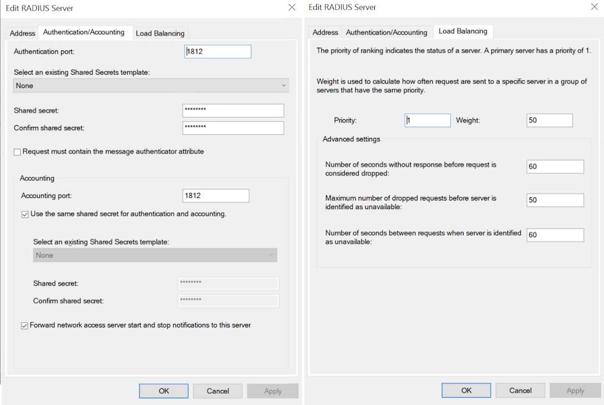
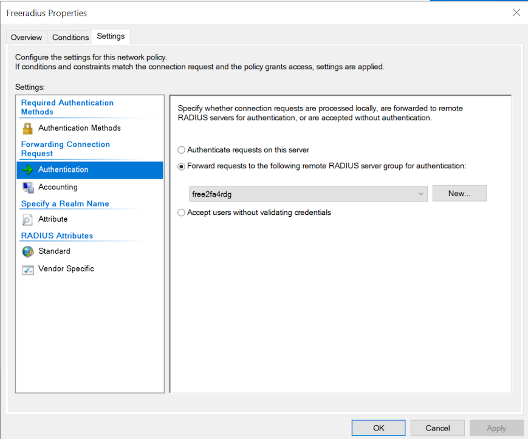
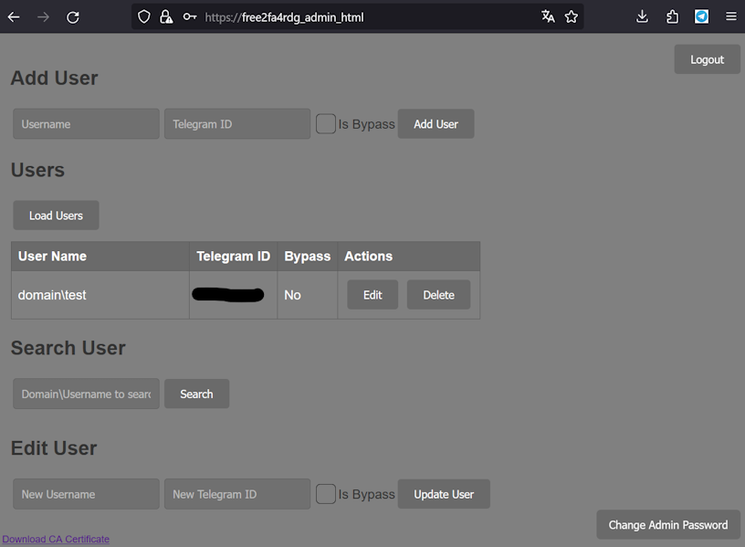

# Free2FA4RDG: A Telegram Bot for Two-Factor Authentication in Windows RD Gateway

[][Docker Hub]
[][License]
[][Codacy Badge]
[][Security Rating]

[Docker Hub]:           https://hub.docker.com/r/clllagob/free2fa4rdg
[License]:              https://github.com/clllagob/free2fa4rdg/blob/master/LICENSE
[Codacy Badge]:         https://app.codacy.com/gh/CLLlAgOB/free2fa4rdg/dashboard?utm_source=gh&utm_medium=referral&utm_content=&utm_campaign=Badge_grade
[Security Rating]:  https://sonarcloud.io/summary/new_code?id=CLLlAgOB_free2fa4rdg


Free2FA4RDG is a free solution for enabling two-factor authentication when using Remote Desktop (RDP) through the Windows Server RD Gateway service. This system uses a Telegram bot as the second factor for authentication, providing an additional layer of security.  
[Версия на русском](./READMERU.md)

## Key Components

- **RD Gateway**: A service that allows secure connection to a desktop through a VPN-like connection.
- **Network Policy Server (NPS)**: Receives requests from the RD Gateway and redirects them to the Free2FA4RDG component.
- **Free2FA4RDG**: Processes authentication requests using the Telegram bot.

## Free2FA4RDG Microservices

Free2FA4RDG consists of several microservices, each performing a specific role within the two-factor authentication system:

### 1. free2fa4rdg_setup
This service is responsible for initial setup and pre-configuration of the system. It includes the generation and management of certificates necessary for the secure operation of other system components.

### 2. free2fa4rdg_admin_html
This service provides a web interface for administrative management of the system.

### 3. free2fa4rdg_admin_api
An API service for the administrative interface, ensuring interaction between the web interface and the server part of the system.

### 4. free2fa4rdg_api
The main API service, handling authentication requests and interacting with the Telegram bot for user login confirmation.

### 5. FreeRADIUS
FreeRADIUS is used in free2fa4rdg. FreeRADIUS is free software and is distributed under [GNU General Public License version 3 (GPL-3.0)](https://www.gnu.org/licenses/gpl-3.0.en.html).
FreeRADIUS official website: [https://freeradius.org/](https://freeradius.org/)
We use FreeRADIUS with no changes to the source code, only with configuration tweaks to meet the requirements of our project.
This component includes a FreeRADIUS server, processing RADIUS requests from the NPS (Network Policy Server) and forwarding them for processing in free2fa4rdg_api.

Each of these services operates in its own Docker container, ensuring modularity and simplifying the scaling of the system.

## Compatibility

The installation script has been tested on Ubuntu 22.04 LTS and CentOS 7. However, as this is a Docker Compose-based setup, it can, in principle, be deployed manually on any Linux system that supports Docker and is compatible with x86 and x64 architectures. This flexibility is due to Docker's containerization technology, which allows the application to run consistently across different Linux distributions as long as Docker and Docker Compose are available.

## Workflow

1. The user connects to RDP through the RD Gateway.
2. The RD Gateway forwards the request to the NPS.
3. The NPS requests the second factor of authentication from Free2FA4RDG.
4. Free2FA4RDG sends a confirmation request to the user's Telegram application.
5. The user confirms the login through Telegram and gains access to RDP.

## Server Requirements

- Registration in Telegram and creation of a bot to obtain an authorization token.
- Presence of installed and configured Remote Desktop Gateway and Network Policy and Access Service components on Windows Server.
- A server with Docker Compose, accessible on UDP port 1812 for NPS and on port 443 for the administrative panel.
- Access to `api.telegram.org` and `hub.docker.com`.

## Installation

### Server Preparation

1. Create a new Telegram bot: https://core.telegram.org/bots#creating-a-new-bot.
2. Install Linux, selecting Ubuntu 22.04 LTS or CentOS 7 (tested on these versions).
3. Create a directory for Free2FA4RDG settings:
   ```
   mkdir -p /opt/2fa/ && cd /opt/2fa/
   ```
4. Run the installation script:
   ```
   curl -o install.sh https://raw.githubusercontent.com/CLLlAgOB/free2fa4rdg/main/install.sh && bash install.sh
   ```
5. Follow the script instructions.
6. Create a dns entry for the admin portal (https://free2fa4rdg_admin_html by default) or the name you specified in the ADDITIONAL_DNS_NAME_FOR_ADMIN_HTML parameter. Default password and login for the admin portal: admin admin.

### NPS Configuration


1. Create a new group in the Remote RADIUS Server Groups section:
   - Group name: `free2fa4rdg`
   - Server: IP address of the Linux server.
   - Shared secret: Your secret, which will be in the .env file (`RADIUS_CLIENT_SECRET`).
   - Load Balancing: set timeouts to 60 seconds each



2. In the Connection Requests Policies, open the properties of the `TS GATEWAY AUTHORIZATION POLICY` policy and set `Forward requests to the following remote RADIUS server group for authentication: free2fa4rdg`.



### Configuration Parameters

- `CA_EXPIRY_DAYS`: Certificate validity period, in days.
- `FREE2FA_TELEGRAM_BOT_TOKEN`: Your Telegram bot token.
- `FREE2FA_TELEGRAM_BOT_LANGUAGE`: Language model (ru or en).
- `FREE2FA_AUTO_REG_ENABLED`: Automatic registration of new users. (New users will be automatically created in the database with Telegram ID 0, the real ID needs to be specified in the admin portal.)
- `FREE2FA_BYPASS_ENABLED`: (true/false) Bypass users without request with Telegram ID 0.
- `RADIUS_CLIENT_SECRET`: Secret phrase for RADIUS.
- `FREE2FA_TIMEOUT`: Waiting time for login confirmation (from 10 to 20).
- `RADIUS_START_SERVERS`: Number of initial RADIUS server processes.
- `RADIUS_MAX_SERVERS`: Maximum number of RADIUS server processes.
- `RADIUS_MAX_SPARE_SERVERS`: Maximum number of backup RADIUS server processes.
- `RADIUS_MIN_SPARE_SERVERS`: Minimum number of backup RADIUS server processes.
- `ADMIN_SECRET_KEY`: Administrator key (generated if left empty).
- `RESET_PASSWORD`: Enabling password reset function (to reset, you will need to specify ADMIN_SECRET_KEY).
- `ALLOW_API_FAILURE_PASS`: (true/false) Allow users to pass without 2FA if `api.telegram.org` is unavailable.
- `ADDITIONAL_DNS_NAME_FOR_ADMIN_HTML`: DNS name of the admin website. It needs to be specified in DNS or hosts for convenient access.

You will need to change your administrator password the first time you log in.



### Change History:

**06.04.2025**  

- The previous version is available by tag v1.0 in the docker hub.
- Updated components and dependencies.  
- Switched from docker-compose to docker compose.  
- Added support for RADIUS Message Authenticator Attribute.

**To upgrade from a previous version:**
1. Host backup(not mandatory but desirable).
2. In the .env file, add the line REQUIRE_MESSAGE_AUTHENTICATOR=true (preferably enable protection)
3. If you enabled protection in REQUIRE_MESSAGE_AUTHENTICATOR=true then in NCP settings enable the checkbox to enable support for the authenticator attribute:   

4. Update the components using the [How to update](#how-to-update) instructions.

**07.04.2025**

In admin_api:
- Fixed DeprecationWarning: datetime.datetime.utcnow()
- Fixed Error 'bcrypt' has no attribute '__about__'
Update the components using the [How to update](#how-to-update) instructions.


## How to update

1. in the folder where docker-compose.yml is located, run the command under root:
```shell
sudo docker compose down -t 0
sudo docker compose pull
sudo docker compose up -d
```
