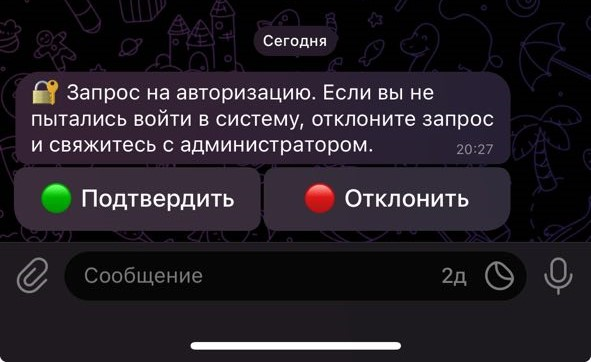
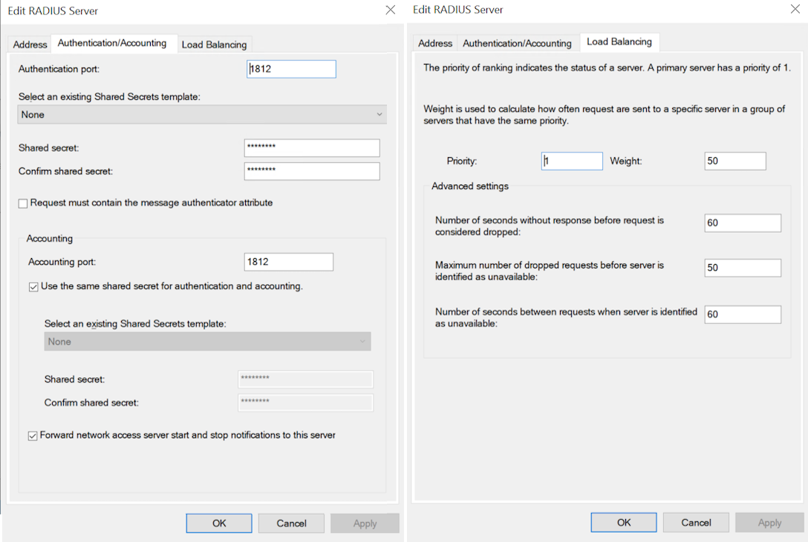
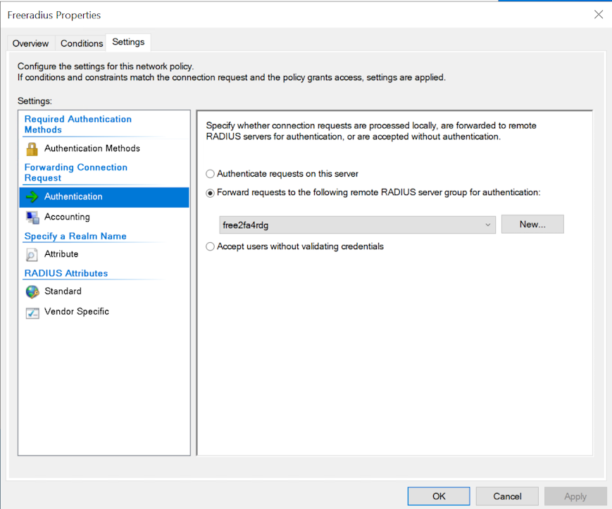
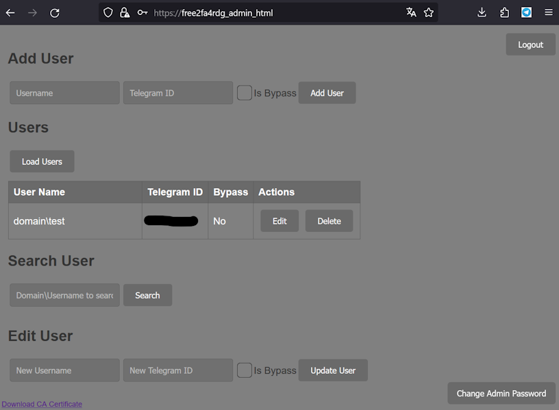
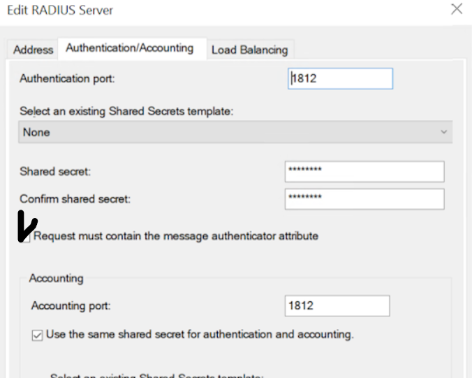

# Free2FA4RDG: Телеграм-бот для двухфакторной аутентификации в Windows RD Gateway

[][Docker Hub]
[][License]
[][Codacy Badge]
[][Security Rating]

[Docker Hub]:           https://hub.docker.com/r/clllagob/free2fa4rdg
[License]:              https://github.com/clllagob/free2fa4rdg/blob/master/LICENSE
[Codacy Badge]:         https://app.codacy.com/gh/CLLlAgOB/free2fa4rdg/dashboard?utm_source=gh&utm_medium=referral&utm_content=&utm_campaign=Badge_grade
[Security Rating]:  https://sonarcloud.io/summary/new_code?id=CLLlAgOB_free2fa4rdg

  

Free2FA4RDG - это бесплатное решение для включения двухфакторной аутентификации при использовании удаленного рабочего стола (RDP) через службу RD Gateway Windows Server. Эта система использует Telegram-бота для второго фактора аутентификации, обеспечивая дополнительный уровень безопасности.

## Основные компоненты

- **RD Gateway**: Служба, позволяющая безопасное подключение к рабочему столу через VPN-подобное соединение.
- **Network Policy Server (NPS)**: Получает запросы от RD Gateway и перенаправляет их на компонент Free2FA4RDG.
- **Free2FA4RDG**: Обрабатывает запросы аутентификации, используя Telegram-бота.

## Микросервисы Free2FA4RDG

Free2FA4RDG состоит из нескольких микросервисов, каждый из которых выполняет свою специфическую роль в рамках системы двухфакторной аутентификации:

### 1. free2fa4rdg_setup
Сервис отвечает за начальную настройку и предварительную конфигурацию системы. Он включает в себя генерацию и управление сертификатами, необходимыми для безопасной работы других компонентов системы.

### 2. free2fa4rdg_admin_html
Сервис предоставляет веб-интерфейс для административного управления системой.

### 3. free2fa4rdg_admin_api
Сервис API для административного интерфейса, который обеспечивает взаимодействие между веб-интерфейсом и серверной частью системы.

### 4. free2fa4rdg_api
Основной сервис API, который обрабатывает запросы аутентификации и взаимодействует с Telegram-ботом для подтверждения входа пользователей.

### 5. FreeRADIUS
В free2fa4rdg используется FreeRADIUS. FreeRADIUS является свободным программным обеспечением и распространяется под [GNU General Public License версии 3 (GPL-3.0)](https://www.gnu.org/licenses/gpl-3.0.en.html).
Официальный сайт FreeRADIUS: [https://freeradius.org/](https://freeradius.org/)
Мы используем FreeRADIUS без изменений в исходном коде, лишь с настройкой конфигурации для соответствия требованиям нашего проекта.
Этот компонент включает в себя сервер FreeRADIUS, который обрабатывает запросы RADIUS от NPS (Network Policy Server) и передает их на обработку в free2fa4rdg_api.

Каждый из этих сервисов работает в своем контейнере Docker, обеспечивая модульность и упрощая масштабирование системы. 

## Совместимость

Сценарий установки был протестирован на Ubuntu 22.04 LTS и CentOS 7. Однако, поскольку это установка на основе Docker Compose, ее, в принципе, можно развернуть вручную на любой Linux-системе, поддерживающей Docker и совместимой с архитектурами x64. Такая гибкость обусловлена технологией контейнеризации Docker, которая позволяет приложению стабильно работать на разных дистрибутивах Linux при условии наличия Docker и Docker Compose.

## Процесс работы

1. Пользователь подключается к RDP через RD Gateway.
2. RD Gateway перенаправляет запрос на NPS.
3. NPS запросит второй фактор аутентификации у Free2FA4RDG.
4. Free2FA4RDG отправляет запрос подтверждения в приложение Telegram пользователя.
5. Пользователь подтверждает вход через Telegram и получает доступ к RDP.

## Требования к серверу

- Регистрация в Telegram и создание бота для получения токена авторизации.
- Наличие установленных и настроенных компонентов Remote Desktop Gateway и Network Policy and Access Service на Windows Server.
- Сервер с Docker Compose, доступный по UDP порту 1812 для NPS и по порту 443 для административной панели.
- Доступ к `api.telegram.org` и `hub.docker.com`.

## Установка

### Подготовка сервера

1. Создайте нового бота Telegram: https://core.telegram.org/bots#creating-a-new-bot.
2. Произведите установку Linux, выбрав Ubuntu 22.04 LTS или CentOS 7 (проверено на этих версиях).
3. Создайте директорию для настроек Free2FA4RDG:
   ```
   mkdir -p /opt/2fa/ && cd /opt/2fa/
   ```
4. Запустите скрипт установки:
   ```
   curl -o install.sh https://raw.githubusercontent.com/CLLlAgOB/free2fa4rdg/main/install.sh && bash install.sh
   ```
5. Следуйте инструкциям скрипта.
6. Создайте запись днс для портала администратора (https://free2fa4rdg_admin_html по умолчанию) либо на то имя что вы указали при  и установите в параметре ADDITIONAL_DNS_NAME_FOR_ADMIN_HTML. Пароль и логин по умолчанию для портала администратора: admin admin.

### Настройка NPS




1. Создайте новую группу в разделе Remote RADIUS Server Groups:
   - Group name: `free2fa4rdg`
   - Server: IP-адрес Linux-сервера.
   - Shared secret: Ваш секрет, который будет в файле .env (`RADIUS_CLIENT_SECRET`).
   - Load Balancing: поставьте таймауты по 60 секунд


2. В Connection Requests Policies откройте свойства политики `TS GATEWAY AUTHORIZATION POLICY` и установите `Forward requests to the following remote RADIUS server group for authentication: free2fa4rdg`.



### Параметры конфигурации

- `CA_EXPIRY_DAYS`: Срок действия сертификата, дней.
- `FREE2FA_TELEGRAM_BOT_TOKEN`: Токен вашего Telegram бота.
- `FREE2FA_TELEGRAM_BOT_LANGUAGE`: (ru или en) Языковая модель.
- `FREE2FA_AUTO_REG_ENABLED`: Автоматическая регистрация новых пользователей.(Новые пользователи буду создаваться в базе автоматически с Telegram ID 0, на портале администратора необходимо указать реальный ID)
- `FREE2FA_BYPASS_ENABLED`: (true/false) Пропуск пользователей без запроса с Telegram ID 0.
- `RADIUS_CLIENT_SECRET`: Секретная фраза для RADIUS.
- `FREE2FA_TIMEOUT`: Время ожидания подтверждения входа(от 10 до 20).
- `RADIUS_START_SERVERS`: Количество начальных процессов RADIUS сервера.
- `RADIUS_MAX_SERVERS`: Максимальное количество процессов RADIUS сервера.
- `RADIUS_MAX_SPARE_SERVERS`: Максимальное количество резервных процессов RADIUS сервера.
- `RADIUS_MIN_SPARE_SERVERS`: Минимальное количество резервных процессов RADIUS сервера.
- `ADMIN_SECRET_KEY`: Ключ администратора (генерируется, если оставить пустым).
- `RESET_PASSWORD`: Включение функции сброса пароля(для сброса потребуется указать ADMIN_SECRET_KEY).
- `ALLOW_API_FAILURE_PASS`: (true/false) Пускать пользователей без 2FA, если `api.telegram.org` недоступен. 
- `ADDITIONAL_DNS_NAME_FOR_ADMIN_HTML`: ДНС имя веб сайта админки. Необходимо прописать его в днс или hosts для удобства доступа.

При первом входе необходимо будет сменить пароль администратора.



### История изменений:

**06.04.2025**  

- Предыдущая версия доступна по тегу v1.0 в docker hub.
- Обновлены компоненты и зависимости.  
- Отказ от docker-compose в пользу docker compose.
- Добавлена поддержка атрибута аутентификатора сообщений RADIUS.

**Для обновления с предыдущей версии:**
1. Бекап хоста(не обязателен но желателен).
2. В файл .env добавить строчку REQUIRE_MESSAGE_AUTHENTICATOR=true (желательно включить защиту)
3. Если включили защиту в REQUIRE_MESSAGE_AUTHENTICATOR=true то в настройках NCP включить галку для включения поддержка атрибута аутентификатора:   

1. Обновите компоненты используя инструкцию [Как обновить](#how-to-update).

**07.04.2025**

В admin_api:
- Исправлено DeprecationWarning: datetime.datetime.utcnow()
- Ошибка 'bcrypt' has no attribute '__about__'

Обновите компоненты используя инструкцию [Как обновить](#how-to-update).


## How to update

1. в папке где лежит docker-compose.yml выполните команду под рутом:
```shell
sudo docker compose down -t 0
sudo docker compose pull
sudo docker compose up -d
```
